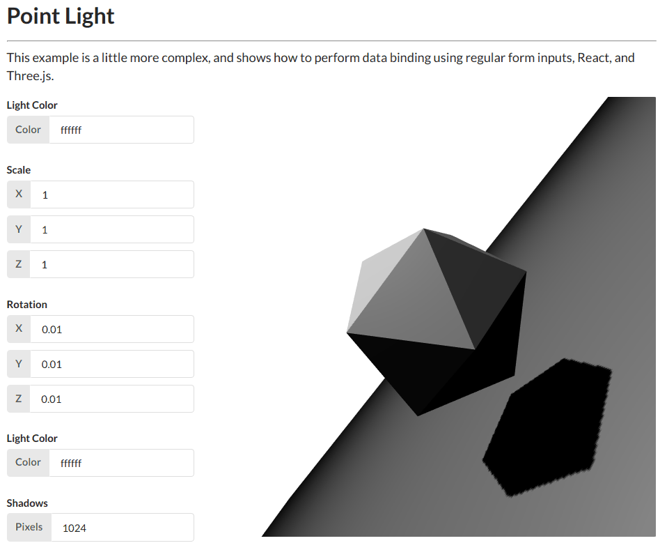

# webgl

Examples, tutorials, mini-projects, ...



Built with

- React + Recompose + Baobab
- Express
- Webpack
- WebGL2
- SCSS

## Usage

Clone the repo, then:

```
npm install
npm start
```

## License

MIT © [Forrest Desjardins](https://github.com/fdesjardins)
